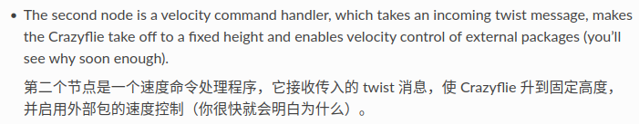

# Crazyflie集群配置

这里使用了22.04lts以及ROS Humble python3.10 没有Conda或Venv
<!-- more -->
## 无人机固件与地址

### 安装cfclient

```bash
pip3 install cfclient
```

安装crazyflie客户端  
>terminal输入cfclient打开客户端

为正常使用Radio，请记得参考[**USB permissions | Bitcraze**](https://www.bitcraze.io/documentation/repository/crazyflie-lib-python/master/installation/usb_permissions/)

### 刷写固件

#### 正常情况下更新固件

1. 打开无人机开关，电机自检完成后，在cfclient左上角输入地址，点击**Scan**扫描，没找到就再点一下

2. 在左边选择对应无人机的地址连接
连接成功点击菜单栏**Connect->Bootloader**，在下面选择cf2，然后选择对应版本的固件，需要Github的链接

3. 点击右下角**Program**即可，无人机会重启数次，一直到左下角的Status显示为**IDLE**就完成了固件升级

#### 固件损坏情况下刷写固件

如果无人机不能正常启动，我们可以手动让他进入bootloader模式

1. 长按无人加按钮约3-5秒后松开，两盏蓝色的灯交替闪烁，即进入冷启动

2. 同样使用cfclient，在**Connect->Bootloader**选择**Coldboot**选项卡

3. 在这里点击**Restart in bootloader mode**，随后即可选择版本并且刷写固件

### 更改无人机地址

无线链接无人机后，点**Connect->configure 2.x** 即可修改参数

>无人机地址格式类似为如下格式  
`0/80/2M/E7E7E7E7E7`  
第一位数字为使用的Radio，默认0使用找到的第一个radio，1则使用第二个radio  
一般使用一个radio即可，若使用多个Radio则保证其均负载  
第二位两个数字为信道，随后是带宽，一般选最高的2M  
后面的为十六进制表示的地址，一般修改最后两位

点击**write**写入，重启无人机即可应用更改

## 动捕配置

在动捕软件标定完成后，打开crazyflie开关，激活红外led marker，如有可能，关闭动捕摄像头的红外发射  
> 先在设备左边栏，全部选中摄像头  
在下面高级设置中更改补光强度，0即关闭红外  

更改对应曝光时间和检测阈值，使得四个点被稳定的识别  
标定刚体后，点击左边栏的传输设置，选择对应交换机组网下的ip，更改方向为z-up，开启vrpn刚体传输即可  

## 使用Crazyswarm

### 安装

可先参考Crazyswarm2的[官方文档](https://imrclab.github.io/crazyswarm2/)
安装对应依赖

随后新建一个ros2_ws/src并进入该目录

```bash
git clone --recursive https://github.com/K4IN1/crazyswarm2_ARIC.git
```

然后回到ros2_ws

```bash
colcon build --symlink-install --cmake-args -DCMAKE_BUILD_TYPE=Release
```

编译完成后记得`source install/setup.bash`

### 配置

绝大多数配置的更改在crazyflie/config中即可完成
主要修改的是motion_capture.yaml和crazyflies.yaml

- motioncap.yaml
  
  ```yaml
  ros__parameters:
    # one of "optitrack", "optitrack_closed_source", "vicon", "qualisys", "nokov", "vrpn", "motionanalysis"
    type: "vrpn"
    # Specify the hostname or IP of the computer running the motion capture software
    hostname: "169.254.210.141"
  ```
  
  将这里的ip改成动捕电脑的ip即可，记得修改网络的网段，手动指定同网段下的ip，例如169.254.210.200
  可以通过`ping <ip>`的形式来确定网络连接

- crazyflies.yaml
  
  ```yaml
  robots:
  cf1:
    enabled: true #这里控制是否启用控制，防止意外连接到开机但是不使用的无人机
    # uri: radio://0/20/2M/E7E7E7E7E9
    uri: radio://0/80/2M/E7E7E7E702 # 更改这里的地址为需要控制的无人机
    initial_position: [0.0, 0.0, 0.0] #仿真用，散点用，刚体不重要
    type: cf21_mocap_deck //与下面的robot_type相对应
    ......
    robot_types:
  cf21:
    motion_capture:
      enabled: false
      # only if enabled; see motion_capture.yaml
      marker: default_single_marker
      dynamics: default
    big_quad: false
    battery:
      voltage_warning: 3.8  # V
      voltage_critical: 3.7 # V
  
  cf21_mocap_deck:
    motion_capture:
      enabled: true //是否启用动捕 ，这里有时会有bug，一般不会出错，如果有出现类似动捕定位失效的情况，可以将这里改成false看看
      # only if enabled; see motion_capture.yaml
      marker: mocap_deck
      dynamics: default
    big_quad: false
    battery:
      voltage_warning: 3.8  # V
      voltage_critical: 3.7 # V
    ......
  all:
    #这里是全局生效的参数，一般不需要修改
  ```

### 使用
  
```bash
ros2 launch crazyflie launch.py 
```
  
使用上述设置启动对应服务
会弹出rviz和nicegui的localhost网页界面
>通过手动移动无人机观测rviz中的无人机位置来确定动捕定位的情况
通过查看nicegui是否为白屏或crazyradio上的灯是否两栖或crazyflie左上角的灯是否为绿色闪烁，**来确定无人机是否连接**
一切准备就绪即可运行python脚本
如要在vscode中直接运行需遵循下述条件

```python
...

def main(): #定义main()

...

if __name__ == '__main__': #独立执行入口
    main()
```

即可  
也可以通过crazyflie_example下的setup.cfg来指定程序入口，更改后需要重新`colcon build`

## 具体函数使用方法

### 核心类Crazyswarm

```python
from crazyflie_py import Crazyswarm
swarm = Crazyswarm()
timeHelper = swarm.timeHelper #时间控制函数
timeHelper.sleep(2.0) # s
allcfs = swarm.allcfs
## 全局使用allcfs.func() 采用相对位置
#如
Z = 0.5
allcfs.takeoff(targetHeight=Z, duration=Z+1.0)  # 绝对高度
timeHelper.sleep(Z+2.0)
allcfs.goTo(...) # 相对位置
```

### 个体类Crazyflie

一般从核心类中获取，可以为个体无人机单独执行某指令

```python
...
name1 = 'cf1' # 与crazyflie.yaml对应
cf1:Crazyflie = swarm.allcfs.crazyfliesByName[name1]
allcfs.takeoff(targetHeight=Z, duration=2.0) # 全部起飞
timeHelper.sleep(Z+2.0) # 绝大多数函数立刻返回，因此要进行sleep（）
cf1.goTo([0.5,0.5,0.5],yaw = 0.0,duration=3.0) # 只有cf1执行这个动作
timeHelper.sleep(4.0)
...
allcfs.land(targetHeight=0.02, duration=2.0) # 全部降落
timeHelper.sleep(2.0)
...
```

更多指令直接参考源码，注释较为详细

### 轨迹格式

参考[**Github_link**](https://github.com/whoenig/uav_trajectories)
通过路点或时间路点生成所需轨迹，执行轨迹请参考example/figure8.py

速度控制需参考cmd_full_state.**py**
或者直接使用teleop Service cmd_vel_world  
正如官方文档所示的

  
<!--    -->
